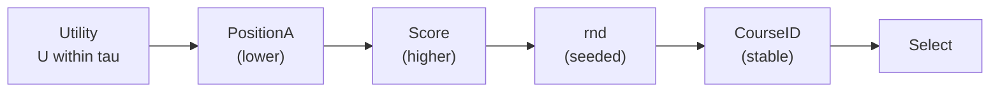

# 1. HBS Social

This repository contains the code and experiments for my master's thesis project on course allocation with social preferences (friendships). The core implementation lives in `HBS/`, with a CLI wrapper at `hbs_social.py`.

## 1.1 What the project does
- Simulates an HBS-style snake draft course allocation.
- Adds a reactive friend bonus to the utility function.
- Supports optional post-draft improvement (swap or add-drop).
- Exports audit logs and fairness/inequality metrics.

## 1.2 Repository layout
- `hbs_social.py` - CLI entrypoint.
- `HBS/` - core engine, API, metrics, and IO.
- `generate/` - synthetic data generator for CSV inputs.
- `tests/` - unit tests.

## 1.3 Input data
The allocator expects three CSV tables (Table 3 is optional):

Table 1: individual course preferences
- columns: `StudentID, CourseID, Score, Position`
- `Position` is a 1-based rank (1 = best) and defines base utility.
- `Score` is used only for deterministic tie-breaking.

Table 2: directed friend preferences per course
- columns: `StudentID_A, StudentID_B, CourseID, Position, Score`
- represents "A prefers to be with B in course".
- `Position` is a 1-based rank among A's friends for that course (top-k).
- `Score` captures the intensity of that friend preference (ties allowed). If missing, the algorithm falls back to Position only.

Table 3: per-student social weight (optional)
- columns: `StudentID, LambdaFriend`
- `LambdaFriend` must be in [0, 1]. If omitted, all students default to 0.3.

Note: `tables/` is treated as local data and is not tracked on GitHub in this project. Use the generator below to create sample CSVs.

## 2. Mathematical model and formulas
This section matches the exact computation implemented in `HBS/` and breaks it into small pieces.

### 2.1 Sets and inputs
- Students: `S`, courses: `C`.
- For each student `s` and course `c`, Table 1 provides `Score(s,c)` and `PositionA(s,c)`.
- For each directed pair `(s, f)` and course `c`, Table 2 provides `PositionB(s,f,c)` and `ScoreB(s,f,c)` (s's friend rank and intensity for f in c).
- Let `F(s,c)` be the top-K friends for student `s` in course `c` after score/position tie-break.
- Per-student social weight `lambda_s` comes from Table 3 (default 0.3 if missing).
- Course capacity is uniform: `cap(c) = cap_default` for all `c`.

### 2.2 Rank-to-utility mapping (Table 1)
Function type: affine Min-Max linear scaling of rank to [0, 1].

Definitions:
- p: the 1-based rank position from Table 1 (PositionA).
- K: the number of courses |C| used for scaling in Table 1.

We convert a 1-based course rank into a utility in [0, 1]:

$$
posU(p, K) =
\begin{cases}
0, & p \text{ is missing} \\
1, & K \le 1 \land p = 1 \\
0, & K \le 1 \land p \ne 1 \\
\frac{K - p}{K - 1}, & K > 1
\end{cases}
$$


Code reference: `HBS/hbs_engine.py:25` (function `_pos_u`).

Example: if K=4, then posU(1,4)=1, posU(2,4)=2/3, posU(4,4)=0; missing p gives 0.

In code, missing `PositionA` yields `Base = 0`, and missing `Score`/`PositionA` are treated as worst-case for tie-breaking.

### 2.3 Friend-rank mapping (Table 2, linear without zero)
Function type: affine linear scaling with a strictly positive minimum for ranked friends.

Definitions:
- p: the 1-based friend rank from Table 2 (PositionB).
- K: the maximum friend rank observed in Table 2 (K_friend).

For friends we use a separate linear mapping so that the lowest rank is still positive:

$$
posU_{friend}(p, K) =
\begin{cases}
0, & p \text{ is missing} \\
0, & K \le 0 \\
\frac{K + 1 - p}{K}, & K > 0
\end{cases}
$$


Code reference: `HBS/hbs_engine.py:41` (function `_pos_u_friend`) and `HBS/hbs_engine.py:149` (derives `K_friend`).

Example: if K=3, then posU_friend(1,3)=1, posU_friend(2,3)=2/3, posU_friend(3,3)=1/3.

This formula is used only as a fallback when ScoreB is missing (or when Table 2 has no scores).

### 2.3.1 Friend-score normalization (Table 2)
Function type: affine Min-Max scaling to [0, 1] with clamping.

Definitions:
- ScoreB(s,f,c): the raw friend score from Table 2.
- score_min, score_max: min/max of all non-missing friend scores in Table 2.

$$
\mathrm{scoreU}(\text{score}) =
\left[
\frac{\text{score} - \text{score}_{\min}}
{\text{score}_{\max} - \text{score}_{\min}}
\right]_{0}^{1}
$$


If the score scale is degenerate (score_max <= score_min), the implementation returns 1.0 for any present score.

Code reference: `HBS/hbs_engine.py:57` (function `_score_u`).

Example: score_min=1, score_max=5 -> score=5 gives scoreU=1, score=3 gives scoreU=0.5, score=1 gives scoreU=0.

### 2.3.2 Friend preference Pref from score (position only tie-break)
Function type: normalized score only (Position is not a numeric component when Score exists).

Definition:
```
Pref(s,f,c) = scoreU(ScoreB(s,f,c))
```

Fallback rule:
- If ScoreB is missing for a row, Pref(s,f,c) = posU_friend(PositionB(s,f,c), K_friend).

Code reference: `HBS/hbs_engine.py:181` (pair weight helper) and `HBS/hbs_engine.py:195` (precompute map).

Example: score range 1..5
- score=5 -> Pref=1
- score=3 -> Pref=0.5
- score=1 -> Pref=0

### 2.4 Utility components (per student and course)
Definitions:
- PositionA(s,c): the 1-based rank of course c for student s from Table 1 (1 = most preferred, k = least preferred).
- PositionB(s,f,c): the 1-based rank of friend f for student s in course c from Table 2 (1 = top friend, K_friend = lowest-ranked friend).
- ScoreB(s,f,c): the friend preference score from Table 2 (ties allowed).

Base utility from Table 1:
Function type: composition of rank-to-utility (affine Min-Max) with the PositionA lookup.

$$
Base(s, c) = posU(PositionA(s,c), |C|)
$$

Code reference: `HBS/hbs_engine.py:138` (precompute) and `HBS/hbs_engine.py:231` (method `_base_utility`).

Example: |C|=4 and PositionA(s,c)=2 gives Base(s,c)=2/3.

Directed friend preference from Table 2 (score-only numeric value):
Function type: normalized score with Position used only as a tie-break.

Plain-text formula:
```
Pref(s,f,c) = scoreU(ScoreB(s,f,c))
```

Fallback rule:
- If ScoreB is missing for a row, Pref(s,f,c) = posU_friend(PositionB(s,f,c), K_friend).

Code reference: `HBS/hbs_engine.py:195` (precompute) and `HBS/hbs_engine.py:256` (method `_friend_preference_utility`).

Tie-break rule for top-K friends (when a (student, course) list is larger than K):
1) sort by ScoreB(s,f,c) descending (higher is better),
2) if scores are equal, sort by PositionB(s,f,c) ascending (1 is better).
If friends <= K, all are kept.

Example A (same score, different position):
- A: Score=3, Position=1 -> Pref=scoreU(3)=0.5
- B: Score=3, Position=2 -> Pref=scoreU(3)=0.5
- Order: A before B because Position is the tie-break.

Example B (different scores):
- A: Score=4, Position=2 -> Pref=scoreU(4)=0.75
- B: Score=2, Position=1 -> Pref=scoreU(2)=0.25
- Order: A before B (no tie-break needed).

Reactive friend bonus (only already allocated friends count):
Function type: weighted sum over a directed friend set with an indicator (reactive overlap).

$$
FriendBonus(s, c) = \sum_{f \in F(s,c)} \mathbb{1}[c \in A_f] \cdot Pref(s,f,c)
$$


Code reference: `HBS/hbs_engine.py:263` (method `_friend_bonus_reactive`).

Interpretation (step-by-step):
1) Take only the friends listed for student s in course c (the directed set F(s,c) from Table 2).
2) For each friend f, check if f already has course c in their current allocation A_f.
3) If yes, add Pref(s,f,c); if no, add 0.
4) Sum over all friends.

Example:
- F(s,c) = {f1, f2, f3}
- Course c = C2
- Current allocations: A_f1 = {C2, C3}, A_f2 = {C1}, A_f3 = {C2}
- Friend preferences (K_friend=3, score range 1..5, all scores=5):
  - Pref(s,f1,C2)=1
  - Pref(s,f2,C2)=1
  - Pref(s,f3,C2)=1

Then only f1 and f3 count (they already have C2), so:


Plain-text:
```
FriendBonus(s, C2) = 1 + 1 = 2
```

Friend bonus normalization (fixed top-K, variant 4):


Plain-text:
```
MaxFriendBonus = K_friend
FriendBonusNorm(s,c) = FriendBonus(s,c) / MaxFriendBonus
```

If Table 2 has no scores at all, the implementation falls back to:

$$
\begin{aligned}
\mathrm{MaxFriendBonus}
&= \sum_{p=1}^{K_{\mathrm{friend}}} \mathrm{posU}_{\mathrm{friend}}(p, K_{\mathrm{friend}})
= \frac{K_{\mathrm{friend}} + 1}{2}.
\end{aligned}
$$


Example (K_friend=3):
- MaxFriendBonus=3
- FriendBonusNorm(s,C2)=2/3≈0.667

Code reference: `HBS/hbs_engine.py:186` (MaxFriendBonus precompute) and `HBS/hbs_engine.py:276` (normalization helper).

Total per-pick utility:
Function type: convex combination of base and normalized friend bonus with weight lambda_s.

$$
U(s, c) = (1 - \lambda_s) \cdot Base(s,c) + \lambda_s \cdot FriendBonusNorm(s,c)
$$

Code reference: `HBS/hbs_engine.py:281` (method `_utility_components`) and `HBS/hbs_engine.py:84` (default lambda).

Example: Base=0.6, lambda_s=0.4, FriendBonusNorm=0.5 -> U=0.6*0.6 + 0.4*0.5 = 0.56.

### 2.5 Feasible choices and pick rule
At a pick, the feasible set is:

$$
C_s = \{ c \in C \mid \mathrm{cap}_{\text{left}}(c) > 0 \;\land\; c \notin A_s \}
$$


Code reference: `HBS/hbs_engine.py:561` (candidate filtering inside `_run_initial_draft`).

Example: C={C1,C2,C3}, cap_left(C2)=0, A_s={C1} -> C_s={C3}.

The chosen course uses a tau-based near-tie rule:
Function type: max utility with a deterministic tie-break when values are within a tolerance.

Plain-text:
```
Umax = max_{c in C_s} U(s,c)
Near = { c in C_s | U(s,c) >= Umax - tau }
Pick the best course in Near by:
1) PositionA ascending (smaller is better)
2) Score descending
3) seeded rnd descending
4) CourseID descending
```
In code, tau = 1e-9 (same tolerance as the earlier rounding-based tie rule).




Code reference: `HBS/hbs_engine.py:575` (score tuple), `HBS/hbs_engine.py:590` (tau-based ordering), and `HBS/hbs_engine.py:236`/`HBS/hbs_engine.py:246` (Position/Score tie-break accessors).

Example: if U is tied and PositionA(C1)=2, PositionA(C2)=1, then C2 wins; if positions equal, higher Score wins, then rnd, then CourseID.

Where `rnd(s,c)` is a seeded random number used only for remaining ties, and `CourseID` is a stable final tie-breaker.

#### *Why a tau threshold is used
Due to floating-point arithmetic, two courses may have utilities that are mathematically equal
but differ by a tiny numerical error:

- `U(s, C1) = 0.33333333333333331`
- `U(s, C2) = 0.33333333333333326`

Without a tolerance, the algorithm would treat `C1` as strictly better and skip all tie-break rules.
With tau = 1e-9, both are considered equal and the decision is resolved using deterministic tie-breakers.

### 2.6 HBS algorithm order
Let `pi` be a random permutation of students (seeded). For round `r`:
- if `r` is odd: order is `pi`
- if `r` is even: order is `reverse(pi)`

Example: pi=[S2,S1,S3] -> round1: S2,S1,S3; round2: S3,S1,S2.

Code reference: `HBS/hbs_engine.py:550` (seeded shuffle) and `HBS/hbs_engine.py:558` (snake order).

### 2.7 Post-phase objective (add-drop or swap)
After the draft, the algorithm can improve the allocation for `post_iters` iterations.

Per-student welfare (final allocation):
Function type: additive sum of per-course utilities over the final allocation.

$$
W_s = \sum_{c \in A_s}
\left[
(1 - \lambda_s) \cdot Base(s,c) + \lambda_s \cdot FriendBonusNorm(s,c)
\right]
$$

Code reference: `HBS/hbs_engine.py:295` (method `_student_welfare`) and `HBS/hbs_engine.py:317` (components).

Example: A_s={C1,C2}, Base(s,C1)=1, Base(s,C2)=0.5, lambda_s=0.4, FriendBonusNorm(s,C1)=0.5, FriendBonusNorm(s,C2)=0 -> W_s=(0.6*1+0.4*0.5)+(0.6*0.5+0)=0.8+0.3=1.1.

Global welfare:
Function type: aggregate sum over students.

$$
W = \sum_{s \in S} W_s
$$

Code reference: `HBS/hbs_engine.py:331` (method `_global_welfare`).

Example: if W_s1=1.9 and W_s2=1.1, then W=3.0.

#### 2.7.1 Add-drop mode (HBS-style pass with spare capacity)
How it works:
1) For each iteration, use the draft order and apply snake parity (odd iterations forward, even iterations reverse).
2) Build a candidate set = current courses of the student + any course with remaining capacity.
3) Score candidates with the same `U(s,c)` utility and pick the top `b` courses.
4) Drop courses not in the top `b` and add newly selected courses (capacity is updated).
5) If no student changes in the pass, the iteration is recorded as a no-op.

Code reference: `HBS/hbs_engine.py:720` (add/drop loop), `HBS/hbs_engine.py:738` (snake order), `HBS/hbs_engine.py:743` (candidate set), `HBS/hbs_engine.py:751` (scoring and top-b selection), `HBS/hbs_engine.py:774` (capacity updates).

Example: if b=2 and a student currently has {C1,C2}, and C3 has free seats with higher utility, the student may drop C2 and add C3, ending with {C1,C3}.

#### 2.7.2 Swap mode (local improvement by swapping courses)
How it works:
1) For every pair of students `(s1, s2)`, enumerate all feasible course swaps `(c1 in A_s1, c2 in A_s2)`.
2) Compute the welfare change `DeltaW = W_after - W_before` using a delta calculation.
3) Select the best positive `DeltaW`. If `DeltaW > 0`, apply the swap; otherwise do nothing for this iteration.
4) Repeat for `post_iters` iterations (deterministic order, deterministic tie-break for equal deltas).

Code reference: `HBS/hbs_engine.py:611` (loop over swap iterations), `HBS/hbs_engine.py:341` (delta computation), `HBS/hbs_engine.py:324` (swap application).

Example: if S1 has C1 and S2 has C2, and swapping increases global welfare by 0.3, the swap is applied; if the best swap gives DeltaW <= 0, the iteration is a no-op.

### 2.8 Normalization for fairness
Let `b` be max courses per student.

Per-student sums on the final allocation:

$$
BaseSum_s = \sum_{c \in A_s} Base(s,c)
$$

Code reference: `HBS/hbs_engine.py:317` (method `_student_welfare_components`).

Example: A_s={C1,C2}, Base(s,C1)=1, Base(s,C2)=0.5 -> BaseSum_s=1.5.

$$
FriendSumRaw_s = \sum_{c \in A_s} \sum_{f \in F(s,c)} \mathbb{1}[c \in A_f] \cdot Pref(s,f,c)
$$

Code reference: `HBS/hbs_engine.py:317` (method `_student_welfare_components`).

Example: if overlaps sum to 1.0 on C1 and 0.2 on C2, then FriendSumRaw_s=1.2.

$$
FriendSumNorm_s = \frac{FriendSumRaw_s}{MaxFriendBonus}
$$

Code reference: `HBS/hbs_engine.py:317` (normalization inside `_student_welfare_components`).

Example: with MaxFriendBonus=3, FriendSumNorm_s=1.2/3=0.4.

$$
Total_s = (1 - \lambda_s) \cdot BaseSum_s + \lambda_s \cdot FriendSumNorm_s
$$

Code reference: `HBS/hbs_engine.py:844` (computes `Total_s` in `_compute_metrics`).

Example: BaseSum_s=1.5, FriendSumNorm_s=0.4, lambda_s=0.4 -> Total_s=0.9+0.16=1.06.

Upper bounds for normalization:

$$
MaxBase_s = \sum_{c \in Top_b} Base(s,c)
$$

Code reference: `HBS/hbs_engine.py:336` (method `_max_possible_base`).

Example: b=2 and Base values across courses are [1.0, 0.6, 0.2] -> MaxBase_s=1.6.

$$
MaxTotalUpper_s = \sum_{c \in Top_b} \Big((1 - \lambda_s) \cdot Base(s,c) + \lambda_s \cdot \frac{\sum_{f \in F(s,c)} Pref(s,f,c)}{MaxFriendBonus}\Big)
$$

Code reference: `HBS/hbs_engine.py:341` (method `_max_possible_total_upper`).

Example: b=2 and the per-course values are [0.9, 0.7, 0.3] -> MaxTotalUpper_s=1.6.

Where `Top_b` selects the `b` courses with largest values in the respective expression (ignoring capacity and reactivity for the upper bound).

Normalized utilities used for inequality metrics:

$$
BaseNorm_s =
\begin{cases}
\frac{BaseSum_s}{MaxBase_s}, & MaxBase_s > 0 \\
0, & \text{otherwise}
\end{cases}
$$

Code reference: `HBS/hbs_engine.py:851` (computes `per_student_base_norm`).

Example: BaseSum_s=1.2 and MaxBase_s=1.6 -> BaseNorm_s=0.75.

$$
TotalNorm_s =
\begin{cases}
\frac{Total_s}{MaxTotalUpper_s}, & MaxTotalUpper_s > 0 \\
0, & \text{otherwise}
\end{cases}
$$

Code reference: `HBS/hbs_engine.py:855` (computes `per_student_total_norm`).

Example: Total_s=1.98 and MaxTotalUpper_s=2.1 -> TotalNorm_s≈0.943.

### 2.9 TotalUtility & GINI metrics
Let `x_i` be a list of non-negative values (the code clamps negatives to 0), sorted in non-decreasing order. Let `n = |x|`.

Total utility:
Function type: sum (L1 aggregate) over a list of values.

$$
TotalUtility = \sum_{i=1}^{n} x_i
$$

Code reference: `HBS/hbs_metrics.py:7` (function `compute_total_utility`).

Example: x=[0.75, 0.25, 1.0] -> TotalUtility=2.0.

Gini index (used for `TotalNorm` and `BaseNorm`):
Function type: normalized Gini coefficient over non-negative values.

We compute two Gini metrics explicitly:

$$
GiniBaseNorm = Gini(\{BaseNorm_s\}_{s \in S})
$$

$$
GiniTotalNorm = Gini(\{TotalNorm_s\}_{s \in S})
$$

Code reference: `HBS/hbs_engine.py:861` (calls `compute_gini_index` for base/total norms).

$$
Gini(x) =
\begin{cases}
0, & \sum_i x_i = 0 \\
\frac{\sum_{i=1}^{n} (2i - n - 1) x_i}{n \cdot \sum_{i=1}^{n} x_i}, & \text{otherwise}
\end{cases}
$$

Code reference: `HBS/hbs_metrics.py:11` (function `compute_gini_index`).

Example: x=[0, 1] -> Gini=0.5; x=[1, 1, 1] -> Gini=0.


## 3. Draft and post-draft logic
1. Seeded random order of students.
2. Snake draft for `draft_rounds` rounds (odd rounds forward, even rounds reverse).
3. Each pick chooses the course with highest utility using deterministic tie-breaks:
   1) max utility within tau (1e-9)
   2) best Position from Table 1 (smaller is better)
   3) highest Score from Table 1
   4) seeded random tie
   5) stable CourseID
4. Optional post-phase for `post_iters` iterations:
   - `swap`: best welfare-improving swap between two students per iteration.
   - `add-drop`: HBS-style pass using only courses with spare capacity.

## 4. Outputs
- `allocation.csv` - draft picks only.
- `post_allocation.csv` - post-phase events (swap/add-drop).
- `summary.csv` - total utility and normalized Gini metrics.
- `metrics_extended.csv` - extended fairness and distribution metrics (Jain, Theil, Atkinson, percentiles, and more).

## 5. Quick start
Requirements: Python 3.10+ (no external dependencies).

Generate sample data:

```bash
python3 generate/generate_tables.py --students 200 --courses 8 --seed 11
```

Run the allocator:

```bash
python3 hbs_social.py \
  --csv-a tables/table1_200x8.csv \
  --csv-b tables/table2_200x8.csv \
  --csv-lambda tables/table3_lambda_200x8.csv \
  --cap-default 80 \
  --b 3 \
  --draft-rounds 3 \
  --post-iters 10 \
  --improve-mode add-drop \
  --seed 11 \
  --out-allocation results/allocation.csv \
  --out-adddrop results/post_allocation.csv \
  --out-summary results/summary.csv \
  --out-metrics-extended results/metrics_extended.csv
```

Useful optional flags: `--progress`, `--sanity-checks`, `--delta-check-every`, `--log-level`.

Run tests:

```bash
python tests/run_all_tests.py
```

## 6. End-to-end toy example (small numbers)
This example shows the full pipeline on a tiny dataset, with explicit numbers for every formula.

### 6.1 Inputs (tables + parameters)
Students: S1, S2, S3
Courses: C1, C2, C3
Parameters: cap_default=2, b=1, draft_rounds=1, improve_mode=none
Draft order (seeded example): S1 -> S2 -> S3

Table 1 (Student -> Course):
```
StudentID,CourseID,Score,Position
S1,C1,5,1
S1,C2,4,2
S1,C3,2,3
S2,C1,4,2
S2,C2,5,1
S2,C3,1,3
S3,C1,5,1
S3,C2,3,2
S3,C3,2,3
```

Table 2 (Friend -> Course, top-2 per course, with Score):
```
StudentID_A,StudentID_B,CourseID,Position,Score
S1,S2,C1,1,5
S1,S3,C1,2,5
S1,S2,C2,1,4
S1,S3,C2,2,2
S1,S2,C3,1,3
S1,S3,C3,2,2
S2,S1,C1,1,5
S2,S3,C1,2,3
S2,S1,C2,1,2
S2,S3,C2,2,2
S2,S1,C3,1,2
S2,S3,C3,2,5
S3,S1,C1,1,1
S3,S2,C1,2,2
S3,S2,C2,1,5
S3,S1,C2,2,5
S3,S1,C3,1,5
S3,S2,C3,2,4
```

Table 3 (lambda):
```
StudentID,LambdaFriend
S1,0.2
S2,0.1
S3,0.8
```

### 6.2 Step 1: Base(s,c) from Table 1 positions
Formula (affine Min-Max rank scaling):
```
posU(p, K) = (K - p) / (K - 1), for K > 1
```
Explanation: lower position is better; for K=3 -> posU(1)=1, posU(2)=0.5, posU(3)=0.
Code reference: `HBS/hbs_engine.py:25`.

Compute base utilities (K=3):
```
S1: Base(C1)=1, Base(C2)=0.5, Base(C3)=0
S2: Base(C1)=0.5, Base(C2)=1, Base(C3)=0
S3: Base(C1)=1, Base(C2)=0.5, Base(C3)=0
```

### 6.3 Step 2: Friend score normalization (Table 2)
Formula (Min-Max to [0,1]):
```
scoreU(score) = clamp((score - score_min) / (score_max - score_min), 0, 1)
```
Explanation: scores are scaled to [0,1], with clamping for safety.
Code reference: `HBS/hbs_engine.py:57`.

In this table: score_min=1, score_max=5, so:
```
score=5 -> scoreU=1
score=4 -> scoreU=0.75
score=3 -> scoreU=0.5
score=2 -> scoreU=0.25
score=1 -> scoreU=0
```

### 6.4 Step 3: Friend rank normalization (Table 2)
Formula (linear without zero):
```
posU_friend(p, K_friend) = (K_friend + 1 - p) / K_friend
```
Explanation: rank 1 maps to 1, rank K maps to 1/K (never zero).
Code reference: `HBS/hbs_engine.py:41`.

Here K_friend=2:
```
posU_friend(1)=1
posU_friend(2)=0.5
```
Note: with ScoreB present, PositionB does not change Pref numerically; it is used only as a tie-break when scores are equal or missing.

### 6.5 Step 4: Directed friend preference Pref(s,f,c)
Formula (score only; Position is tie-break only):
```
Pref(s,f,c) = scoreU(ScoreB)
```
Explanation: Score drives the weight; Position does not change the numeric Pref if Score is present.
Code reference: `HBS/hbs_engine.py:181` and `HBS/hbs_engine.py:195`.

Useful values (score range 1..5):
```
score=5 -> Pref=1
score=4 -> Pref=0.75
score=3 -> Pref=0.5
score=2 -> Pref=0.25
score=1 -> Pref=0
```

### 6.6 Step 5: FriendBonus and normalization
Reactive friend bonus formula:
```
FriendBonus(s,c) = sum over friends f in F(s,c):
    indicator(friend f already has course c) * Pref(s,f,c)
```
Explanation: only friends already allocated to c contribute.
Code reference: `HBS/hbs_engine.py:263`.

Normalization (fixed top-K):
```
MaxFriendBonus = K_friend
FriendBonusNorm(s,c) = FriendBonus(s,c) / MaxFriendBonus
```
Explanation: Pref is in [0,1], so the max sum across K_friend friends is K_friend.
Code reference: `HBS/hbs_engine.py:186` and `HBS/hbs_engine.py:276`.

For K_friend=2:
```
MaxFriendBonus=2
```

### 6.7 Step 6: Per-course utility and pick rule
Utility formula:
```
U(s,c) = (1 - lambda_s) * Base(s,c) + lambda_s * FriendBonusNorm(s,c)
```
Explanation: convex mix of base and normalized friend bonus.
Code reference: `HBS/hbs_engine.py:281`.

Pick rule:
```
Choose the feasible course with maximum U(s,c).
```
Explanation: capacity and "already picked" filters apply first, then U is maximized; ties within tau use PositionA, then ScoreA, then seeded random and CourseID.
Code reference: `HBS/hbs_engine.py:590` and `HBS/hbs_engine.py:281`.

Now we apply this to each pick:

Pick 1 (S1, lambda=0.2, no friends allocated yet):
```
FriendBonusNorm for all courses = 0
U(C1)=0.8*1 + 0 = 0.8
U(C2)=0.8*0.5 + 0 = 0.4
U(C3)=0.8*0 + 0 = 0
Pick: C1
```

Pick 2 (S2, lambda=0.1, S1 already in C1):
```
FriendBonus(C1) = Pref(S2,S1,C1)=1
FriendBonusNorm(C1)=1/2=0.5
FriendBonusNorm(C2)=0
FriendBonusNorm(C3)=0

U(C1)=0.9*0.5 + 0.1*0.5 = 0.45 + 0.05 = 0.50
U(C2)=0.9*1.0 + 0 = 0.9
U(C3)=0
Pick: C2
```

Pick 3 (S3, lambda=0.8, S1 in C1, S2 in C2):
```
FriendBonus(C1) = Pref(S3,S1,C1)=0
FriendBonusNorm(C1)=0/2=0

FriendBonus(C2) = Pref(S3,S2,C2)=1
FriendBonusNorm(C2)=1/2=0.5

FriendBonus(C3)=0

U(C1)=0.2*1.0 + 0.8*0 = 0.2
U(C2)=0.2*0.5 + 0.8*0.5 = 0.1 + 0.4 = 0.5
U(C3)=0
Pick: C2 (social preference dominates base)
```

### 6.8 Final allocation and totals
Final allocation (b=1):
```
S1 -> C1
S2 -> C2
S3 -> C2
```

Per-student welfare (since b=1, W_s = U(s, chosen course)):
```
W_S1 = 0.8000
W_S2 = 0.9000
W_S3 = 0.5000
TotalUtility = 2.2000
```

This example shows how:
1) rank-to-utility normalization defines Base,
2) friend scores and ranks produce Pref,
3) Pref is normalized into FriendBonusNorm,
4) U mixes Base and FriendBonusNorm using lambda,
5) the draft order + capacity filters determine the final allocation.
