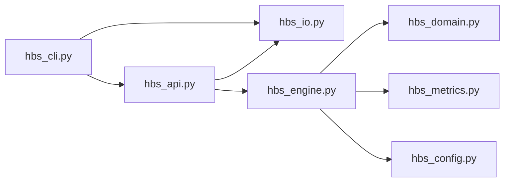
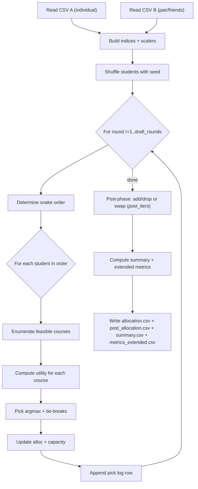

# HBS Social Snake Draft (Reactive Friends)

A small research/experimentation script that simulates a **snake draft** course allocation with a **social utility component** (friends), inspired by an HBS-style picking process.

The implementation lives in `hbs_social.py` and is designed to be:
- Deterministic (given `--seed` and the same CSV inputs)
- Auditable (writes a per-pick log with utility decomposition)
- Tunable (weights allow you to explore trade-offs between individual preference, social cohesion, and fairness proxies)

---

## Problem Statement & Motivation

**Problem.** You have a set of students and a set of courses with fixed seat capacities. Each student wants to take up to `b` courses. Students also care about **being in the same courses as their friends** (or specific peers), in addition to their personal preferences.

**Why it matters.**
- In real allocation systems (course bidding, school electives, training cohorts), ignoring social structure can reduce perceived satisfaction and participation.
- Social-aware allocation helps explore outcomes like: “Do friends end up together?”, “How does social preference impact fairness?”, and “What are the trade-offs with pure preference satisfaction?”

This repository provides a simple, transparent baseline for experimentation.

---

## High-Level Idea

Instead of solving a single global optimization problem (which can be complex or expensive), we simulate a **sequential picking process**:

1. Students are placed in a random order (seeded).
2. They take turns picking one course per round.
3. In each turn, a student selects the course with the highest **utility**:
   - **Base utility** from their own preference table
   - A **friend bonus** that rewards picking courses already chosen by friends (reactive)

This captures a realistic “human process” (drafts are used in practice), while being easy to reason about and modify.

---

## Algorithm Description

### Inputs
- Table 1 (individual preferences): `(StudentID, CourseID, Score, Position)`
- Table 2 (pair/friend preferences): `(StudentID_A, StudentID_B, CourseID, Position)`
- Global parameters: capacities, number of rounds, and utility weights.

### Step-by-step
1. **Load CSVs** and collect the universe of `students` and `courses` (from both tables).
2. Initialize capacity for each course: `cap_left[c] = cap_default`.
3. Initialize allocation per student: `alloc[s] = []`.
4. **Create a deterministic random order** of students (shuffle using `seed`).
5. For each round `r = 1..b`:
   - Determine the turn order:
     - odd rounds: forward order
     - even rounds: reverse order (snake draft)
   - For each student in turn order:
     1. Enumerate feasible candidates: courses with remaining capacity and not already picked by the student.
     2. Compute the utility for each candidate course.
     3. Choose the course with the maximum utility (with deterministic tie-breaks).
     4. Update allocation and capacity.
     5. Append a `PickLogRow` including base + friend bonus components.
6. After all rounds, compute summary metrics:
   - Total utility
   - Gini indices on normalized utilities
7. Write outputs:
   - `allocation.csv`: draft picks
   - `post_allocation.csv`: add/drop or swap log
   - `summary.csv`: one-row summary for the run
   - `metrics_extended.csv`: extended metrics for analysis

### Deterministic tie-breaking
When two courses have similar utility, the script breaks ties using:
1. max total utility
2. best (smallest) `Position` from Table 1
3. highest `Score` from Table 1
4. seeded random number
5. stable `CourseID` ordering

This makes results stable and reproducible while still allowing stochastic exploration via `--seed`.

---

## Mathematical Formulation

This is a **sequential decision process**, not a single global solver. Still, the per-pick decision is defined by an explicit utility function.

### Sets and indices
- Students: $S$
- Courses: $C$
- Rounds: $r \in \{1,\dots,b\}$
- Directed friend relation (from Table 2): $F(s) \subseteq S$ are friends of student $s$ (out-neighbors).

### Parameters
- Course capacity (uniform in the implementation): $\mathrm{cap}(c) = \mathrm{cap\_default}$
- Table 1 base utility is rank-only: derived from `PositionA` (Table 1 `Score` is used only for tie-breaking)
- Per-student social weight: $\lambda_s$ from Table 3 (how much friend bonus matters for each student)

### Normalization utilities
Let $\mathrm{posU}(p;K) \in [0,1]$ map a 1-based rank position to a utility given $K$ options:

$$
\mathrm{posU}(p;K) = \frac{K-p}{K-1} \quad (\text{for } K>1)
$$

(with safe handling for degenerate cases in code).

### Base utility (Table 1)
For student $s$ and course $c$:

$$
\mathrm{Base}(s,c) = \mathrm{posU}(\mathrm{PositionA}(s,c);|C|)
$$

Missing records are treated as zero in the implementation.

### Friend preference utility (Table 2)
Directed preference of $s$ to be with friend $f$ in course $c$:

$$
\mathrm{Pref}(s,f,c) = u_P \cdot \mathrm{posU}(\mathrm{PositionB}(s,f,c);k)
$$

Where $k$ is the maximum friend-rank position in Table 2 (typically $k=3$ for “top-3 friends”).

Missing records are treated as zero.

### Reactive friend bonus
Let $A_f \subseteq C$ be the set of courses already allocated to friend $f$ at the current time. Then:

$$
\mathrm{FriendBonus}(s,c) = \sum_{f \in F(s)} \mathbf{1}[c \in A_f] \cdot \mathrm{Pref}(s,f,c)
$$

This is “reactive” because it only rewards overlap with **already-picked** courses.

### Per-pick utility (decision rule)
At each pick, student $s$ selects:

$$
c^\* = \arg\max_{c \in \mathcal{C}_s} \left(
\mathrm{Base}(s,c) + \lambda_s \cdot \mathrm{FriendBonus}(s,c)
\right)
$$

Where feasible set:

$$
\mathcal{C}_s = \{ c \in C \mid \mathrm{cap\_left}(c) > 0 \ \wedge\ c \notin A_s \}
$$


### Constraints
This process enforces constraints by construction:
- Capacity: total assigned to each course never exceeds capacity.
- No duplicates: a student never picks the same course twice.
- Demand is “up to $b$”: if candidates are exhausted, the student skips remaining picks.

---

## Utility Function Logic (Deep Dive)

### Why this utility makes sense
- **Base(s,c)** represents an individual student’s private preference over courses.
- **FriendBonus(s,c)** captures *realized* social matching: it rewards choosing a course that friends already chose (cohesion).
This blend provides a controlled way to explore **preference vs. social cohesion vs. fairness** in a realistic sequential process.

### Tunable parameters

#### Base construction weights
- Table 1 `Score` is not part of the utility model; it is used only as a tertiary deterministic tie-breaker when needed.

#### Friend preference weights
- Per-student $\lambda_s$ comes from Table 3 (`--csv-lambda`) and scales the friend bonus for each student.

---

## Practical Usage

### Requirements
- Python 3.10+ (uses modern typing)

# Running the Algorithm

This section explains how to run the course allocation algorithm and describes
each input argument in a user-friendly way.

## Run

```bash
python3 hbs_social.py \
  --csv-a tables/table1_individual.csv \
  --csv-b tables/table2_pair.csv \
  --csv-lambda tables/table3_lambda.csv \
  --cap-default 80 \
  --b 3 \
  --draft-rounds 3 \
  --post-iters 2 \
  --seed 42 \
  --out-allocation allocation.csv \
  --out-adddrop post_allocation.csv \
  --out-summary summary.csv \
  --out-metrics-extended metrics_extended.csv
```

Example: 200 students × 8 courses
```bash
python3 hbs_social.py \
  --csv-a tables/table1_200x8.csv \
  --csv-b tables/table2_200x8.csv \
  --csv-lambda tables/table3_lambda_200x8.csv \
  --cap-default 80 \
  --b 3 \
  --draft-rounds 3 \
  --post-iters 2 \
  --improve-mode add-drop \
  --seed 42 \
  --out-allocation results/allocation_200x8.csv \
  --out-adddrop results/adddrop_200x8.csv \
  --out-summary results/summary_200x8.csv \
  --out-metrics-extended results/metrics_extended_200x8.csv
```

## Input arguments

- **`--csv-a`**  
  Path to **Table 1 (individual preferences)**.  
  Contains each student’s personal ranking and/or score for courses.

- **`--csv-b`**  
  Path to **Table 2 (pair / friend preferences)**.  
  Describes each student’s top-k friend choices per course via `Position` (1 = best).

- **`--csv-lambda`**  
  Path to **Table 3 (per-student lambda)**.  
  `LambdaFriend` ∈ [0,1] controls how much friend bonus matters for each student.  
  If a student is missing from this table, the default `lambda_s` is `0.5`.

- **`--cap-default`**  
  Default **capacity per course**.  
  Each course can accept at most this many students.

- **`--b`**  
  Maximum **courses per student**.

- **`--draft-rounds`**  
  Number of **draft rounds** (defaults to `b`).

- **`--post-iters`** / **`--n`**  
  Number of **post-allocation iterations** (add/drop or swap).  
  `--n` is a backward-compatible alias.

- **`--seed`**  
  Random seed for **reproducibility**.  
  Using the same seed guarantees identical results.

- **`--improve-mode`**  
  Post-allocation mode: `swap` (pairwise swaps) or `add-drop` (HBS-style add/drop with spare capacity).

- **`--out-allocation`**  
  Output CSV file with **draft picks only** (RoundPicked, StudentID, CourseID).

- **`--out-adddrop`**  
  Output CSV file with **post-allocation events** (add/drop or swap).

- **`--out-summary`**  
  Output CSV file with **aggregate statistics**  
  (e.g., average utility, satisfaction metrics, social matching indicators).

- **`--out-metrics-extended`**  
  Output CSV file with **extended metrics** (fairness indices, rank satisfaction, social overlap, etc.).


### Input CSV formats

**Table 1 (`--csv-a`)**
```csv
StudentID,CourseID,Score,Position
S1,C1,3,4
...
```

**Table 2 (`--csv-b`)**
```csv
StudentID_A,StudentID_B,CourseID,Position
S1,S2,C1,1
...
```

**Table 3 (`--csv-lambda`)**
```csv
StudentID,LambdaFriend
S1,0.5
S2,0.5
...
```

Interpretation:
- Table 2 is directed: A’s preference about being with B in a specific course.

### Output files

**Allocation log (`allocation.csv`)**
- One row per pick, including:
  - RoundPicked, StudentID, CourseID

**Run summary (`summary.csv`)**
- One row with:
  - Parameters used
  - `total_utility`, `gini_total_norm`, `gini_base_norm`

**Extended metrics (`metrics_extended.csv`)**
- One row with:
  - Additional metrics (Jain/Theil/Atkinson, rank satisfaction, social overlap, fill rates, percentiles)

---

## Code Structure Overview

Main entrypoint: `hbs_social.py` (wrapper around the CLI).

Modules:
- `hbs_domain.py`: dataclasses (inputs/outputs)
- `hbs_metrics.py`: fairness/utility metrics
- `hbs_config.py`: run configuration
- `hbs_engine.py`: algorithm + allocation logic
- `hbs_io.py`: CSV readers/writers
- `hbs_api.py`: `run_hbs_social()` public API
- `hbs_cli.py`: argparse + CLI I/O

Interaction flow:
1. CLI parses args → calls `hbs_api.run_hbs_social()`
2. API loads CSVs → builds engine → `engine.run()`
3. Result is written via `hbs_io` writers

---

## Visual Aids & Illustrations

### Module structure (Mermaid)


### Algorithm flow (Mermaid)


### Conceptual illustration (ASCII)
```
Round 1 order:  s1 -> s2 -> s3 -> s4
Round 2 order:  s4 -> s3 -> s2 -> s1
Round 3 order:  s1 -> s2 -> s3 -> s4

At each pick:
  utility = base + lambda_s * friend_overlap_bonus
```

---

## Possible Improvements & Extensions

### Algorithmic improvements
- **Global optimization baseline:** compare against ILP / min-cost flow / matching for small instances.
- **Capacity heterogeneity:** allow per-course capacities (currently a single `cap_default`).
- **Prerequisites / incompatibilities:** model constraints like “cannot take C1 and C2 together”.
- **Priority / fairness policies:** add rules like quotas, priorities, or envy-reduction heuristics.
- **Strategic behavior:** model that students may not reveal true preferences; explore robustness.

### Utility model extensions
- **Diminishing returns for friend overlap:** e.g., first overlapping friend counts more than the tenth.
- **Group constraints:** allocate cohorts or teams rather than individual pairs.
- **Symmetric friend utility:** enforce mutual friend edges or combine both directions.

### Architectural refactoring
- Split `hbs_social.py` into modules:
  - `domain/` for dataclasses
  - `io/` for CSV readers/writers
  - `engine/` for allocation logic
  - `cli/` for command parsing
- Add unit tests with fixtures for determinism, tie-breaking, and metric correctness.
- Add structured logging and optional JSON outputs for downstream tooling.

---

## Future Work

This baseline can be extended toward more realistic and complex allocation systems:
- **Multi-term scheduling:** courses have time slots; students cannot overlap.
- **Budgets / bidding:** students spend points; the allocator balances bids + social terms.
- **Multiple sections per course:** choose section-level capacity and schedule constraints.
- **Learning weights:** fit $\lambda_s$ (and other parameters) from observed behavior.
- **Policy evaluation:** run Monte Carlo experiments across seeds and report distributions, not just point metrics.

---

## License / Status

This repository is currently a lightweight research prototype intended for experimentation and teaching.
