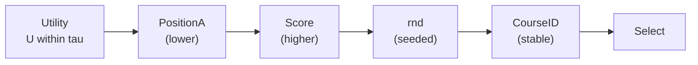

# HBS Social: Course Allocation with Friendships

This repository contains a master's thesis implementation of course allocation with
social preferences. It combines an HBS-style sequential draft with course rankings,
directed friendship preferences, configurable picking rules, and optional post-draft
local improvement. The project can be used from a local web interface, the command
line, or the Python API.

## 1. What the project does
- Simulates an HBS-style sequential course allocation.
- Adds a reactive friend bonus to the utility function.
- Supports personal and social-welfare-aware course selection.
- Supports snake, round-robin, and n-first picking sequences.
- Supports optional post-draft improvement (swap, add-drop, or hybrid).
- Exports audit logs and fairness/inequality metrics.
- Provides a dependency-free local web UI for generating inputs, running allocations,
  following progress, and comparing results.

### What changed in `new-ui-update`

Compared with `post-iters-improvement`, this branch adds:

- a local browser application (`hbs_web.py` and `webui/index.html`) with live progress,
  allocation visualization, result history, and side-by-side run comparison;
- a `social` pick rule that internalizes the friendship benefit received by students
  already enrolled in a candidate course;
- configurable `snake`, `round-robin`, and `n-first` picking sequences;
- a `hybrid` improvement mode combining add-drop passes with welfare-improving swaps;
- additional fair-division metrics: egalitarian welfare, Nash welfare, envy, and EF1;
- correlated synthetic preferences through `--popularity-strength`;
- an optional ILP benchmark for measuring heuristic optimality gaps;
- progress callbacks and richer visualization events in the Python engine/API.

## 2. Repository layout
- `hbs_social.py` - CLI entrypoint.
- `hbs_web.py` + `webui/` - local web UI: `python hbs_web.py` opens a browser panel
  to generate data, configure a run (sequence, pick rule, post-phase), execute it,
  and compare runs side by side. Stdlib only, serves on 127.0.0.1.
- `HBS/` - core engine, API, metrics, and IO.
- `generate/` - synthetic data generator for CSV inputs.
- `experiments/` - ILP optimality benchmark (requires `pip install pulp`):
  solves the same allocation problem to proven optimality (utilitarian or
  egalitarian max-min objective) so heuristics can be reported with an
  optimality gap. See `experiments/ilp_benchmark.py --help`.
- `tests/` - unit tests.

## 3. Quick start: web UI

Requirements: Python 3.10+ and a modern browser. The allocator and web application
use only the Python standard library.

```bash
python3 hbs_web.py
```

The command opens `http://127.0.0.1:8765`. From the page you can:

1. Generate the three synthetic input tables or select existing CSV files from
   `tables/`.
2. Configure capacity, courses per student, draft rounds, post-phase iterations,
   sequence, pick rule, and improvement mode.
3. Run the allocator and follow draft/improvement events as they happen.
4. Inspect allocations and fairness metrics, retain runs in the browser session,
   and compare selected runs side by side.

Useful server options:

```bash
python3 hbs_web.py --port 9000
python3 hbs_web.py --no-browser
```

The server binds only to `127.0.0.1`. Generated files are stored in `tables/`, which
is intentionally excluded from Git.

## 4. Input data
The allocator expects three CSV tables (Table 3 is optional):

Table 1: individual course preferences
- columns: `StudentID, CourseID, Score, Position`
- `Position` is a 1-based rank (1 = best) and defines base utility.
- `Score` is used only for deterministic tie-breaking.

Table 2: directed friend preferences per course
- columns: `StudentID_A, StudentID_B, CourseID, Position, Score`
- represents "A prefers to be with B in course".
- `Position` is a 1-based rank among A's friends for that course (top-k).
- `Score` captures the intensity of that friend preference (ties allowed). If missing, the algorithm falls back to Position only.

Table 3: per-student social weight (optional)
- columns: `StudentID, LambdaFriend`
- `LambdaFriend` must be in [0, 1]. If omitted, all students default to 0.3.

Note: `tables/` is treated as local data and is not tracked on GitHub in this project. Use the generator below to create sample CSVs.

## 5. Mathematical model and formulas
This section matches the exact computation implemented in `HBS/` and breaks it into small pieces.

### 5.1 Sets and inputs
- Students: `S`, courses: `C`.
- For each student `s` and course `c`, Table 1 provides `Score(s,c)` and `PositionA(s,c)`.
- For each directed pair `(s, f)` and course `c`, Table 2 provides `PositionB(s,f,c)` and `ScoreB(s,f,c)` (s's friend rank and intensity for f in c).
- Let `F(s,c)` be the top-K friends for student `s` in course `c` after score/position tie-break.
- Per-student social weight `lambda_s` comes from Table 3 (default 0.3 if missing).
- Course capacity is uniform: `cap(c) = cap_default` for all `c`.

### 5.2 Rank-to-utility mapping (Table 1)
Function type: affine Min-Max linear scaling of rank to [0, 1].

Definitions:
- p: the 1-based rank position from Table 1 (PositionA).
- K: the number of courses |C| used for scaling in Table 1.

We convert a 1-based course rank into a utility in [0, 1]:

$$
posU(p, K) =
\begin{cases}
0, & p \text{ is missing} \\
1, & K \le 1 \land p = 1 \\
0, & K \le 1 \land p \ne 1 \\
\frac{K - p}{K - 1}, & K > 1
\end{cases}
$$


Code reference: `HBS/hbs_engine.py` (function `_pos_u`).

Example: if K=4, then posU(1,4)=1, posU(2,4)=2/3, posU(4,4)=0; missing p gives 0.

In code, missing `PositionA` yields `Base = 0`, and missing `Score`/`PositionA` are treated as worst-case for tie-breaking.

### 5.3 Friend-rank mapping (Table 2, linear without zero)
Function type: affine linear scaling with a strictly positive minimum for ranked friends.

Definitions:
- p: the 1-based friend rank from Table 2 (PositionB).
- K: the maximum friend rank observed in Table 2 (K_friend).

For friends we use a separate linear mapping so that the lowest rank is still positive:

$$
posU_{friend}(p, K) =
\begin{cases}
0, & p \text{ is missing} \\
0, & K \le 0 \\
\frac{K + 1 - p}{K}, & K > 0
\end{cases}
$$


Code reference: `HBS/hbs_engine.py` (function `_pos_u_friend`) and `HBS/hbs_engine.py` (derives `K_friend`).

Example: if K=3, then posU_friend(1,3)=1, posU_friend(2,3)=2/3, posU_friend(3,3)=1/3.

This formula is used only as a fallback when ScoreB is missing (or when Table 2 has no scores).

### 5.3.1 Friend-score normalization (Table 2)
Function type: affine Min-Max scaling to [0, 1] with clamping.

Definitions:
- ScoreB(s,f,c): the raw friend score from Table 2.
- score_min, score_max: min/max of all non-missing friend scores in Table 2.

$$
\mathrm{scoreU}(\text{score}) =
\left[
\frac{\text{score} - \text{score}_{\min}}
{\text{score}_{\max} - \text{score}_{\min}}
\right]_{0}^{1}
$$


If the score scale is degenerate (score_max <= score_min), the implementation returns 1.0 for any present score.

Code reference: `HBS/hbs_engine.py` (function `_score_u`).

Example: score_min=1, score_max=5 -> score=5 gives scoreU=1, score=3 gives scoreU=0.5, score=1 gives scoreU=0.

### 5.3.2 Friend preference Pref from score (position only tie-break)
Function type: normalized score only (Position is not a numeric component when Score exists).

Definition:
```
Pref(s,f,c) = scoreU(ScoreB(s,f,c))
```

Fallback rule:
- If ScoreB is missing for a row, Pref(s,f,c) = posU_friend(PositionB(s,f,c), K_friend).

Code reference: `HBS/hbs_engine.py` (pair weight helper) and `HBS/hbs_engine.py` (precompute map).

Example: score range 1..5
- score=5 -> Pref=1
- score=3 -> Pref=0.5
- score=1 -> Pref=0

### 5.4 Utility components (per student and course)
Definitions:
- PositionA(s,c): the 1-based rank of course c for student s from Table 1 (1 = most preferred, k = least preferred).
- PositionB(s,f,c): the 1-based rank of friend f for student s in course c from Table 2 (1 = top friend, K_friend = lowest-ranked friend).
- ScoreB(s,f,c): the friend preference score from Table 2 (ties allowed).

Base utility from Table 1:
Function type: composition of rank-to-utility (affine Min-Max) with the PositionA lookup.

$$
Base(s, c) = posU(PositionA(s,c), |C|)
$$

Code reference: `HBS/hbs_engine.py` (precompute) and `HBS/hbs_engine.py` (method `_base_utility`).

Example: |C|=4 and PositionA(s,c)=2 gives Base(s,c)=2/3.

Directed friend preference from Table 2 (score-only numeric value):
Function type: normalized score with Position used only as a tie-break.

Plain-text formula:
```
Pref(s,f,c) = scoreU(ScoreB(s,f,c))
```

Fallback rule:
- If ScoreB is missing for a row, Pref(s,f,c) = posU_friend(PositionB(s,f,c), K_friend).

Code reference: `HBS/hbs_engine.py` (precompute) and `HBS/hbs_engine.py` (method `_friend_preference_utility`).

Tie-break rule for top-K friends (when a (student, course) list is larger than K):
1) sort by ScoreB(s,f,c) descending (higher is better),
2) if scores are equal, sort by PositionB(s,f,c) ascending (1 is better).
If friends <= K, all are kept.

Example A (same score, different position):
- A: Score=3, Position=1 -> Pref=scoreU(3)=0.5
- B: Score=3, Position=2 -> Pref=scoreU(3)=0.5
- Order: A before B because Position is the tie-break.

Example B (different scores):
- A: Score=4, Position=2 -> Pref=scoreU(4)=0.75
- B: Score=2, Position=1 -> Pref=scoreU(2)=0.25
- Order: A before B (no tie-break needed).

Reactive friend bonus (only already allocated friends count):
Function type: weighted sum over a directed friend set with an indicator (reactive overlap).

$$
FriendBonus(s, c) = \sum_{f \in F(s,c)} \mathbb{1}[c \in A_f] \cdot Pref(s,f,c)
$$


Code reference: `HBS/hbs_engine.py` (method `_friend_bonus_reactive`).

Interpretation (step-by-step):
1) Take only the friends listed for student s in course c (the directed set F(s,c) from Table 2).
2) For each friend f, check if f already has course c in their current allocation A_f.
3) If yes, add Pref(s,f,c); if no, add 0.
4) Sum over all friends.

Example:
- F(s,c) = {f1, f2, f3}
- Course c = C2
- Current allocations: A_f1 = {C2, C3}, A_f2 = {C1}, A_f3 = {C2}
- Friend preferences (K_friend=3, score range 1..5, all scores=5):
  - Pref(s,f1,C2)=1
  - Pref(s,f2,C2)=1
  - Pref(s,f3,C2)=1

Then only f1 and f3 count (they already have C2), so:


Plain-text:
```
FriendBonus(s, C2) = 1 + 1 = 2
```

Friend bonus normalization (fixed top-K, variant 4):


Plain-text:
```
MaxFriendBonus = K_friend
FriendBonusNorm(s,c) = FriendBonus(s,c) / MaxFriendBonus
```

If Table 2 has no scores at all, the implementation falls back to:

$$
\begin{aligned}
\mathrm{MaxFriendBonus}
&= \sum_{p=1}^{K_{\mathrm{friend}}} \mathrm{posU}_{\mathrm{friend}}(p, K_{\mathrm{friend}})
= \frac{K_{\mathrm{friend}} + 1}{2}.
\end{aligned}
$$


Example (K_friend=3):
- MaxFriendBonus=3
- FriendBonusNorm(s,C2)=2/3≈0.667

Code reference: `HBS/hbs_engine.py` (MaxFriendBonus precompute) and `HBS/hbs_engine.py` (normalization helper).

Total per-pick utility:
Function type: convex combination of base and normalized friend bonus with weight lambda_s.

$$
U(s, c) = (1 - \lambda_s) \cdot Base(s,c) + \lambda_s \cdot FriendBonusNorm(s,c)
$$

Code reference: `HBS/hbs_engine.py` (method `_utility_components`) and `HBS/hbs_engine.py` (default lambda).

Example: Base=0.6, lambda_s=0.4, FriendBonusNorm=0.5 -> U=0.6*0.6 + 0.4*0.5 = 0.56.

### 5.5 Feasible choices and pick rule
At a pick, the feasible set is:

$$
C_s = \{ c \in C \mid \mathrm{cap}_{\text{left}}(c) > 0 \;\land\; c \notin A_s \}
$$


Code reference: `HBS/hbs_engine.py` (candidate filtering inside `_run_initial_draft`).

Example: C={C1,C2,C3}, cap_left(C2)=0, A_s={C1} -> C_s={C3}.

The value used to rank a feasible course depends on `--pick-rule`:

```text
personal: PickValue(s,c) = U(s,c)
social:   PickValue(s,c) = U(s,c) + SocialGain(s,c)
```

`SocialGain(s,c)` is the marginal friendship utility created for students who are
already enrolled in `c` and list `s` as a friend for that course. The `social` rule
therefore internalizes an externality that the reactive personal utility alone does
not see. It changes only draft selection; final welfare and reported metrics use the
same utility definition in section 5.4.

Code reference: `HBS/hbs_engine.py` (`_social_gain` and `_pick_value`).

The chosen course then uses a tau-based near-tie rule:
Function type: max pick value with a deterministic tie-break when values are within a tolerance.

Plain-text:
```
Umax = max_{c in C_s} U(s,c)
Near = { c in C_s | U(s,c) >= Umax - tau }
Pick the best course in Near by:
1) PositionA ascending (smaller is better)
2) Score descending
3) seeded rnd descending
4) CourseID descending
```
In code, tau = 1e-9 (same tolerance as the earlier rounding-based tie rule).


```mermaid
flowchart LR
    A["Utility<br/>U within tau"]
    B["PositionA<br/>(lower)"]
    C["Score<br/>(higher)"]
    D["rnd<br/>(seeded)"]
    E["CourseID<br/>(stable)"]

    A --> B --> C --> D --> E --> Z["Select"]
```


Code reference: `HBS/hbs_engine.py` (score tuple), `HBS/hbs_engine.py` (tau-based ordering), and `HBS/hbs_engine.py`/`HBS/hbs_engine.py` (Position/Score tie-break accessors).

Example: if U is tied and PositionA(C1)=2, PositionA(C2)=1, then C2 wins; if positions equal, higher Score wins, then rnd, then CourseID.

Where `rnd(s,c)` is a seeded random number used only for remaining ties, and `CourseID` is a stable final tie-breaker.

#### *Why a tau threshold is used
Due to floating-point arithmetic, two courses may have utilities that are mathematically equal
but differ by a tiny numerical error:

- `U(s, C1) = 0.33333333333333331`
- `U(s, C2) = 0.33333333333333326`

Without a tolerance, the algorithm would treat `C1` as strictly better and skip all tie-break rules.
With tau = 1e-9, both are considered equal and the decision is resolved using deterministic tie-breakers.

### 5.6 Picking sequence (draft order)
Let `pi` be a random permutation of students (seeded). The order per round is controlled
by `--sequence` (fair-division terminology):

- `snake` (balanced alternation, default): odd rounds `pi`, even rounds `reverse(pi)`.
- `round-robin`: `pi` in every round.
- `n-first`: `pi` in round 1, then `reverse(pi)` in every later round, so the agent who
  picked last in round 1 picks first in all subsequent rounds. This sequence has the best
  maximin-share (MMS) guarantee among recursively balanced picking sequences
  (Celine, Suksompong, Yuen, AAMAS 2026, arXiv:2512.17604).

Example (snake): pi=[S2,S1,S3] -> round1: S2,S1,S3; round2: S3,S1,S2.

Code reference: `HBS/hbs_engine.py` (`_turn_order`, seeded shuffle in `_run_initial_draft`).

### 5.7 Post-phase objective
After the draft, the algorithm can improve the allocation for `post_iters` iterations.

Per-student welfare (final allocation):
Function type: additive sum of per-course utilities over the final allocation.

$$
W_s = \sum_{c \in A_s}
\left[
(1 - \lambda_s) \cdot Base(s,c) + \lambda_s \cdot FriendBonusNorm(s,c)
\right]
$$

Code reference: `HBS/hbs_engine.py` (method `_student_welfare`) and `HBS/hbs_engine.py` (components).

Example: A_s={C1,C2}, Base(s,C1)=1, Base(s,C2)=0.5, lambda_s=0.4, FriendBonusNorm(s,C1)=0.5, FriendBonusNorm(s,C2)=0 -> W_s=(0.6*1+0.4*0.5)+(0.6*0.5+0)=0.8+0.3=1.1.

Global welfare:
Function type: aggregate sum over students.

$$
W = \sum_{s \in S} W_s
$$

Code reference: `HBS/hbs_engine.py` (method `_global_welfare`).

Example: if W_s1=1.9 and W_s2=1.1, then W=3.0.

#### 5.7.1 Add-drop mode (HBS-style pass with spare capacity)
How it works:
1) For each iteration, use the draft order and apply snake parity (odd iterations forward, even iterations reverse).
2) Build a candidate set = current courses of the student + any course with remaining capacity.
3) Score candidates with the same `U(s,c)` utility and pick the top `b` courses.
4) Drop courses not in the top `b` and add newly selected courses (capacity is updated).
5) If no student changes in the pass, the iteration is recorded as a no-op.

Code reference: `HBS/hbs_engine.py` (add/drop loop), `HBS/hbs_engine.py` (snake order), `HBS/hbs_engine.py` (candidate set), `HBS/hbs_engine.py` (scoring and top-b selection), `HBS/hbs_engine.py` (capacity updates).

Example: if b=2 and a student currently has {C1,C2}, and C3 has free seats with higher utility, the student may drop C2 and add C3, ending with {C1,C3}.

#### 5.7.2 Swap mode (local improvement by swapping courses)
How it works:
1) For every pair of students `(s1, s2)`, enumerate all feasible course swaps `(c1 in A_s1, c2 in A_s2)`.
2) Compute the welfare change `DeltaW = W_after - W_before` using a delta calculation.
3) Select the best positive `DeltaW`. If `DeltaW > 0`, apply the swap; otherwise do nothing for this iteration.
4) Repeat for `post_iters` iterations (deterministic order, deterministic tie-break for equal deltas).

Code reference: `HBS/hbs_engine.py` (loop over swap iterations), `HBS/hbs_engine.py` (delta computation), `HBS/hbs_engine.py` (swap application).

Example: if S1 has C1 and S2 has C2, and swapping increases global welfare by 0.3, the swap is applied; if the best swap gives DeltaW <= 0, the iteration is a no-op.

#### 5.7.3 Hybrid mode

For each requested iteration, hybrid mode first runs one add-drop pass. If that pass
makes no change, the engine applies the best positive-welfare swap, if one exists.
This combines the spare-capacity neighborhood of add-drop with the capacity-preserving
exchange neighborhood of swap without applying both mutations in the same iteration.

Code reference: `HBS/hbs_engine.py` (`_run_hybrid_improvement`).

### 5.8 Normalization for fairness
Let `b` be max courses per student.

Per-student sums on the final allocation:

$$
BaseSum_s = \sum_{c \in A_s} Base(s,c)
$$

Code reference: `HBS/hbs_engine.py` (method `_student_welfare_components`).

Example: A_s={C1,C2}, Base(s,C1)=1, Base(s,C2)=0.5 -> BaseSum_s=1.5.

$$
FriendSumRaw_s = \sum_{c \in A_s} \sum_{f \in F(s,c)} \mathbb{1}[c \in A_f] \cdot Pref(s,f,c)
$$

Code reference: `HBS/hbs_engine.py` (method `_student_welfare_components`).

Example: if overlaps sum to 1.0 on C1 and 0.2 on C2, then FriendSumRaw_s=1.2.

$$
FriendSumNorm_s = \frac{FriendSumRaw_s}{MaxFriendBonus}
$$

Code reference: `HBS/hbs_engine.py` (normalization inside `_student_welfare_components`).

Example: with MaxFriendBonus=3, FriendSumNorm_s=1.2/3=0.4.

$$
Total_s = (1 - \lambda_s) \cdot BaseSum_s + \lambda_s \cdot FriendSumNorm_s
$$

Code reference: `HBS/hbs_engine.py` (computes `Total_s` in `_compute_metrics`).

Example: BaseSum_s=1.5, FriendSumNorm_s=0.4, lambda_s=0.4 -> Total_s=0.9+0.16=1.06.

Upper bounds for normalization:

$$
MaxBase_s = \sum_{c \in Top_b} Base(s,c)
$$

Code reference: `HBS/hbs_engine.py` (method `_max_possible_base`).

Example: b=2 and Base values across courses are [1.0, 0.6, 0.2] -> MaxBase_s=1.6.

$$
MaxTotalUpper_s = \sum_{c \in Top_b} \Big((1 - \lambda_s) \cdot Base(s,c) + \lambda_s \cdot \frac{\sum_{f \in F(s,c)} Pref(s,f,c)}{MaxFriendBonus}\Big)
$$

Code reference: `HBS/hbs_engine.py` (method `_max_possible_total_upper`).

Example: b=2 and the per-course values are [0.9, 0.7, 0.3] -> MaxTotalUpper_s=1.6.

Where `Top_b` selects the `b` courses with largest values in the respective expression (ignoring capacity and reactivity for the upper bound).

Normalized utilities used for inequality metrics:

$$
BaseNorm_s =
\begin{cases}
\frac{BaseSum_s}{MaxBase_s}, & MaxBase_s > 0 \\
0, & \text{otherwise}
\end{cases}
$$

Code reference: `HBS/hbs_engine.py` (computes `per_student_base_norm`).

Example: BaseSum_s=1.2 and MaxBase_s=1.6 -> BaseNorm_s=0.75.

$$
TotalNorm_s =
\begin{cases}
\frac{Total_s}{MaxTotalUpper_s}, & MaxTotalUpper_s > 0 \\
0, & \text{otherwise}
\end{cases}
$$

Code reference: `HBS/hbs_engine.py` (computes `per_student_total_norm`).

Example: Total_s=1.98 and MaxTotalUpper_s=2.1 -> TotalNorm_s≈0.943.

### 5.9 TotalUtility & GINI metrics
Let `x_i` be a list of non-negative values (the code clamps negatives to 0), sorted in non-decreasing order. Let `n = |x|`.

Total utility:
Function type: sum (L1 aggregate) over a list of values.

$$
TotalUtility = \sum_{i=1}^{n} x_i
$$

Code reference: `HBS/hbs_metrics.py` (function `compute_total_utility`).

Example: x=[0.75, 0.25, 1.0] -> TotalUtility=2.0.

Gini index (used for `TotalNorm` and `BaseNorm`):
Function type: normalized Gini coefficient over non-negative values.

We compute two Gini metrics explicitly:

$$
GiniBaseNorm = Gini(\{BaseNorm_s\}_{s \in S})
$$

$$
GiniTotalNorm = Gini(\{TotalNorm_s\}_{s \in S})
$$

Code reference: `HBS/hbs_engine.py` (calls `compute_gini_index` for base/total norms).

$$
Gini(x) =
\begin{cases}
0, & \sum_i x_i = 0 \\
\frac{\sum_{i=1}^{n} (2i - n - 1) x_i}{n \cdot \sum_{i=1}^{n} x_i}, & \text{otherwise}
\end{cases}
$$

Code reference: `HBS/hbs_metrics.py` (function `compute_gini_index`).

Example: x=[0, 1] -> Gini=0.5; x=[1, 1, 1] -> Gini=0.


## 6. Draft and post-draft logic
1. Seeded random order of students.
2. Apply the configured `snake`, `round-robin`, or `n-first` sequence for
   `draft_rounds` rounds.
3. Each pick chooses the course with the highest personal or social pick value:
   1) max pick value within tau (1e-9)
   2) best Position from Table 1 (smaller is better)
   3) highest Score from Table 1
   4) seeded random tie
   5) stable CourseID
4. Optional post-phase for `post_iters` iterations:
   - `swap`: best welfare-improving swap between two students per iteration.
   - `add-drop`: HBS-style pass using only courses with spare capacity.
   - `hybrid`: add-drop first; if unchanged, apply the best improving swap.

## 7. Outputs
- `allocation.csv` - draft picks only.
- `post_allocation.csv` - post-phase events (swap, add-drop, or hybrid).
- `summary.csv` - total utility and normalized Gini metrics.
- `metrics_extended.csv` - extended fairness and distribution metrics (Jain, Theil, Atkinson, percentiles, and more), including fair-division objectives:
  - `egalitarian_welfare` / `egalitarian_welfare_norm` - utility of the worst-off student (raw / normalized).
  - `nash_welfare_geomean` - geometric mean of per-student utilities (Nash welfare).
  - `envy_pairs_share_{base,friend,total}` - share of ordered student pairs with envy under the course-only, friend-only, and combined valuations.
  - `ef1_violation_share_{base,friend,total}` - share of students whose envy survives removing the single best course from the envied bundle (EF1 violation). Friend overlap for a hypothetical bundle is evaluated against the current allocation of all other students.

## 8. Quick start
Requirements: Python 3.10+ (no external dependencies).

Generate sample data:

```bash
mkdir -p tables results
python3 generate/generate_tables.py --students 200 --courses 8 --seed 11
```

Run the allocator:

```bash
python3 hbs_social.py \
  --csv-a tables/table1_individual.csv \
  --csv-b tables/table2_pair.csv \
  --csv-lambda tables/table3_lambda.csv \
  --cap-default 80 \
  --b 3 \
  --draft-rounds 3 \
  --post-iters 10 \
  --improve-mode add-drop \
  --seed 11 \
  --out-allocation results/allocation.csv \
  --out-adddrop results/post_allocation.csv \
  --out-summary results/summary.csv \
  --out-metrics-extended results/metrics_extended.csv
```

Useful optional flags: `--progress`, `--sanity-checks`, `--delta-check-every`, `--log-level`.

Run tests:

```bash
python tests/run_all_tests.py
```

## 8.1 CLI options (generate tables + allocator)
This section lists the available flags for `generate_tables.py` and `hbs_social.py`,
with short explanations and concrete examples.

### 8.1.1 `generate/generate_tables.py`
Creates three CSVs: Table 1 (individual preferences), Table 2 (friend preferences),
Table 3 (per-student lambda).

If `--students` or `--courses` is omitted, the script will prompt for the value.

**Flags**
- `--students N` - number of students (required unless provided interactively).
- `--courses K` - number of courses (required unless provided interactively).
- `--seed SEED` - RNG seed for reproducibility (default: none).
- `--score-min INT` - minimum score for Table 1 (default: 1).
- `--score-max INT` - maximum score for Table 1 (default: 5).
- `--swap-prob P` - probability of swapping adjacent positions when ranking Table 1
  (0..1, default: 0.0). Use `> 0` to introduce small rank noise.
- `--popularity-strength A` - preference correlation (0..1, default: 0.0). With `A > 0`
  each student's latent value for a course is `A * popularity(course) + (1-A) * noise`,
  so students compete for the same popular courses. `A = 0` keeps fully independent
  random preferences (little contention).
- `--friend-top-k K` - top-K friends per (student, course) in Table 2 (default: 3).
- `--friend-score-min INT` - min score for Table 2 friends (default: `--score-min`).
- `--friend-score-max INT` - max score for Table 2 friends (default: `--score-max`).
- `--friend-score-mode {score_first,position_first}` - how friend Score/Position are
  generated (default: `score_first`).
- `--friend-swap-prob P` - swap probability for friend ranking (0..1, default: 0.0).
- `--lambda-default X` - lambda value for all students in Table 3 (0..1, default: 0.3).
- `--out1 PATH` - output CSV for Table 1 (default: `tables/table1_individual.csv`).
- `--out2 PATH` - output CSV for Table 2 (default: `tables/table2_pair.csv`).
- `--out3 PATH` - output CSV for Table 3 (default: `tables/table3_lambda.csv`).

**Examples**
Generate with custom score ranges and friend top-k:
```bash
python3 generate/generate_tables.py \
  --students 120 \
  --courses 6 \
  --seed 7 \
  --score-min 1 \
  --score-max 7 \
  --friend-top-k 4 \
  --friend-score-min 1 \
  --friend-score-max 9 \
  --lambda-default 0.25 \
  --out1 tables/table1_120x6.csv \
  --out2 tables/table2_120x6.csv \
  --out3 tables/table3_lambda_120x6.csv
```

Interactive mode (will prompt for N and K):
```bash
python3 generate/generate_tables.py --seed 11
```

Generate 200x8 with custom lambda:
```bash
python3 generate/generate_tables.py \
  --students 200 \
  --courses 8 \
  --seed 11 \
  --lambda-default 0.4 \
  --out1 tables/table1_200x8.csv \
  --out2 tables/table2_200x8.csv \
  --out3 tables/table3_lambda_200x8.csv
```

### 8.1.2 `hbs_social.py` (allocator)
Runs the configurable draft with reactive friend bonus and an optional post-phase.

**Input flags**
- `--csv-a PATH` - Table 1 CSV (default: `tables/table1_individual.csv`).
- `--csv-b PATH` - Table 2 CSV (default: `tables/table2_pair.csv`).
- `--csv-lambda PATH` - optional Table 3 CSV with per-student lambda.

**Draft + improve flags**
- `--cap-default INT` - capacity per course (default: 10).
- `--b INT` - max courses per student (default: 3).
- `--draft-rounds INT` - number of draft rounds (default: `b`).
- `--post-iters INT` or `--n INT` - post-phase iterations (default: 0).
- `--improve-mode {swap,add-drop,hybrid}` - post-phase mode (default: `swap`).
  `hybrid` runs one add-drop pass per iteration and, when the pass changes nothing,
  applies the single best welfare-improving swap (combines both neighborhoods).
- `--sequence {snake,round-robin,n-first}` - picking sequence for the draft
  (default: `snake`; see section 5.6).
- `--pick-rule {personal,social}` - value used to rank candidate courses at pick time
  (default: `personal`). `personal` maximizes the student's own U(s,c); `social`
  maximizes the marginal global welfare U(s,c) + SocialGain(s,c), where SocialGain
  is the welfare gain of already-enrolled followers who list the student among their
  top-K friends for that course (the pick internalizes friendship externalities).
- `--seed INT` - RNG seed (default: 42).
- `--progress` - print progress during draft/improve (flag).

**Output flags**
- `--out-allocation PATH` - CSV with draft picks only
  (default: `allocation.csv`).
- `--out-adddrop PATH` - CSV with post-phase events
  (default: `post_allocation.csv`).
- `--out-summary PATH` - CSV with summary metrics (default: `summary.csv`).
- `--out-metrics-extended PATH` - CSV with extended metrics
  (default: `metrics_extended.csv`).

**Debug/checking flags**
- `--sanity-checks` - enable extra invariants and consistency checks.
- `--delta-check-every N` - validate swap deltas every N swaps (0 = off).
- `--log-level {CRITICAL,ERROR,WARNING,INFO,DEBUG}` - logging verbosity.

**Examples**
Basic run (no post-phase):
```bash
python3 hbs_social.py \
  --csv-a tables/table1_200x8.csv \
  --csv-b tables/table2_200x8.csv \
  --cap-default 80 \
  --b 3 \
  --draft-rounds 3 \
  --seed 11
```

Add-drop post-phase with custom outputs:
```bash
python3 hbs_social.py \
  --csv-a tables/table1_200x8.csv \
  --csv-b tables/table2_200x8.csv \
  --csv-lambda tables/table3_lambda_200x8.csv \
  --cap-default 80 \
  --b 3 \
  --draft-rounds 3 \
  --post-iters 10 \
  --improve-mode add-drop \
  --seed 11 \
  --out-allocation results/allocation.csv \
  --out-adddrop results/post_allocation.csv \
  --out-summary results/summary.csv \
  --out-metrics-extended results/metrics_extended.csv \
  --progress \
  --sanity-checks \
  --log-level INFO
```

## 8.2 ILP optimality benchmark

The draft and local-improvement methods are heuristics. For small or medium instances,
the optional ILP benchmark can compute a proven optimum for either total welfare or
the welfare of the worst-off student.

Install the only optional dependency:

```bash
python3 -m pip install pulp
```

Run a utilitarian benchmark against the same inputs and constraints:

```bash
python3 experiments/ilp_benchmark.py \
  --csv-a tables/table1_200x8.csv \
  --csv-b tables/table2_200x8.csv \
  --csv-lambda tables/table3_lambda_200x8.csv \
  --cap-default 80 \
  --b 3 \
  --objective utilitarian \
  --time-limit 300 \
  --out-csv results/optimal_allocation.csv
```

Use `--objective egalitarian` for the max-min objective. ILP runtime can grow quickly
with the number of students, courses, and friendship edges.

## 9. End-to-end toy example (small numbers)
This example shows the full pipeline on a tiny dataset, with explicit numbers for every formula.

### 9.1 Inputs (tables + parameters)
Students: S1, S2, S3
Courses: C1, C2, C3
Parameters: cap_default=2, b=1, draft_rounds=1, post_iters=0
Draft order (seeded example): S1 -> S2 -> S3

Table 1 (Student -> Course):
```
StudentID,CourseID,Score,Position
S1,C1,5,1
S1,C2,4,2
S1,C3,2,3
S2,C1,4,2
S2,C2,5,1
S2,C3,1,3
S3,C1,5,1
S3,C2,3,2
S3,C3,2,3
```

Table 2 (Friend -> Course, top-2 per course, with Score):
```
StudentID_A,StudentID_B,CourseID,Position,Score
S1,S2,C1,1,5
S1,S3,C1,2,5
S1,S2,C2,1,4
S1,S3,C2,2,2
S1,S2,C3,1,3
S1,S3,C3,2,2
S2,S1,C1,1,5
S2,S3,C1,2,3
S2,S1,C2,1,2
S2,S3,C2,2,2
S2,S1,C3,1,2
S2,S3,C3,2,5
S3,S1,C1,1,1
S3,S2,C1,2,2
S3,S2,C2,1,5
S3,S1,C2,2,5
S3,S1,C3,1,5
S3,S2,C3,2,4
```

Table 3 (lambda):
```
StudentID,LambdaFriend
S1,0.2
S2,0.1
S3,0.8
```

### 9.2 Step 1: Base(s,c) from Table 1 positions
Formula (affine Min-Max rank scaling):
```
posU(p, K) = (K - p) / (K - 1), for K > 1
```
Explanation: lower position is better; for K=3 -> posU(1)=1, posU(2)=0.5, posU(3)=0.
Code reference: `HBS/hbs_engine.py`.

Compute base utilities (K=3):
```
S1: Base(C1)=1, Base(C2)=0.5, Base(C3)=0
S2: Base(C1)=0.5, Base(C2)=1, Base(C3)=0
S3: Base(C1)=1, Base(C2)=0.5, Base(C3)=0
```

### 9.3 Step 2: Friend score normalization (Table 2)
Formula (Min-Max to [0,1]):
```
scoreU(score) = clamp((score - score_min) / (score_max - score_min), 0, 1)
```
Explanation: scores are scaled to [0,1], with clamping for safety.
Code reference: `HBS/hbs_engine.py`.

In this table: score_min=1, score_max=5, so:
```
score=5 -> scoreU=1
score=4 -> scoreU=0.75
score=3 -> scoreU=0.5
score=2 -> scoreU=0.25
score=1 -> scoreU=0
```

### 9.4 Step 3: Friend rank normalization (Table 2)
Formula (linear without zero):
```
posU_friend(p, K_friend) = (K_friend + 1 - p) / K_friend
```
Explanation: rank 1 maps to 1, rank K maps to 1/K (never zero).
Code reference: `HBS/hbs_engine.py`.

Here K_friend=2:
```
posU_friend(1)=1
posU_friend(2)=0.5
```
Note: with ScoreB present, PositionB does not change Pref numerically; it is used only as a tie-break when scores are equal or missing.

### 9.5 Step 4: Directed friend preference Pref(s,f,c)
Formula (score only; Position is tie-break only):
```
Pref(s,f,c) = scoreU(ScoreB)
```
Explanation: Score drives the weight; Position does not change the numeric Pref if Score is present.
Code reference: `HBS/hbs_engine.py` and `HBS/hbs_engine.py`.

Useful values (score range 1..5):
```
score=5 -> Pref=1
score=4 -> Pref=0.75
score=3 -> Pref=0.5
score=2 -> Pref=0.25
score=1 -> Pref=0
```

### 9.6 Step 5: FriendBonus and normalization
Reactive friend bonus formula:
```
FriendBonus(s,c) = sum over friends f in F(s,c):
    indicator(friend f already has course c) * Pref(s,f,c)
```
Explanation: only friends already allocated to c contribute.
Code reference: `HBS/hbs_engine.py`.

Normalization (fixed top-K):
```
MaxFriendBonus = K_friend
FriendBonusNorm(s,c) = FriendBonus(s,c) / MaxFriendBonus
```
Explanation: Pref is in [0,1], so the max sum across K_friend friends is K_friend.
Code reference: `HBS/hbs_engine.py` and `HBS/hbs_engine.py`.

For K_friend=2:
```
MaxFriendBonus=2
```

### 9.7 Step 6: Per-course utility and pick rule
Utility formula:
```
U(s,c) = (1 - lambda_s) * Base(s,c) + lambda_s * FriendBonusNorm(s,c)
```
Explanation: convex mix of base and normalized friend bonus.
Code reference: `HBS/hbs_engine.py`.

Pick rule:
```
Choose the feasible course with maximum U(s,c).
```
Explanation: capacity and "already picked" filters apply first, then U is maximized; ties within tau use PositionA, then ScoreA, then seeded random and CourseID.
Code reference: `HBS/hbs_engine.py` and `HBS/hbs_engine.py`.

Now we apply this to each pick:

Pick 1 (S1, lambda=0.2, no friends allocated yet):
```
FriendBonusNorm for all courses = 0
U(C1)=0.8*1 + 0 = 0.8
U(C2)=0.8*0.5 + 0 = 0.4
U(C3)=0.8*0 + 0 = 0
Pick: C1
```

Pick 2 (S2, lambda=0.1, S1 already in C1):
```
FriendBonus(C1) = Pref(S2,S1,C1)=1
FriendBonusNorm(C1)=1/2=0.5
FriendBonusNorm(C2)=0
FriendBonusNorm(C3)=0

U(C1)=0.9*0.5 + 0.1*0.5 = 0.45 + 0.05 = 0.50
U(C2)=0.9*1.0 + 0 = 0.9
U(C3)=0
Pick: C2
```

Pick 3 (S3, lambda=0.8, S1 in C1, S2 in C2):
```
FriendBonus(C1) = Pref(S3,S1,C1)=0
FriendBonusNorm(C1)=0/2=0

FriendBonus(C2) = Pref(S3,S2,C2)=1
FriendBonusNorm(C2)=1/2=0.5

FriendBonus(C3)=0

U(C1)=0.2*1.0 + 0.8*0 = 0.2
U(C2)=0.2*0.5 + 0.8*0.5 = 0.1 + 0.4 = 0.5
U(C3)=0
Pick: C2 (social preference dominates base)
```

### 9.8 Final allocation and totals
Final allocation (b=1):
```
S1 -> C1
S2 -> C2
S3 -> C2
```

Per-student welfare (since b=1, W_s = U(s, chosen course)):
```
W_S1 = 0.8000
W_S2 = 0.9000
W_S3 = 0.5000
TotalUtility = 2.2000
```

This example shows how:
1) rank-to-utility normalization defines Base,
2) friend scores and ranks produce Pref,
3) Pref is normalized into FriendBonusNorm,
4) U mixes Base and FriendBonusNorm using lambda,
5) the draft order + capacity filters determine the final allocation.
